**SENG 438 - Software Testing, Reliability, and Quality**

**Lab. Report \#4 – Mutation Testing and Web app testing**

| Group \#:  1         |
| --------------     |
| Dominic Gartner    |
| Hamd Khan          |
| Alexander Mclean   |
| Noel Thomas        |

# Introduction

# Analysis of 10 Mutants of the Range class 
## Range Function:
```
89    public Range(double lower, double upper) {
90        if (lower > upper) {
91           String msg = "Range(double, double): require lower (" + lower
92               + ") <= upper (" + upper + ").";
93           throw new IllegalArgumentException(msg);
94       }
95       this.lower = lower;
96       this.upper = upper;
97   }
``` 

## Mutants:
### Survived Mutants:
- Line 90: removed conditional
  - replaced comparison check with false The test suite did not cover cases where lower > upper, so this mutant survived.
- Line 95: Decremented (a--) double local variable number 1
  - This mutant tells us that our test suite did not cover the case of changing the value of lower to be decremented by 1.
- Line 95: Incremented (a++) double local variable number 1
  - This mutant tells us that our test suite did not cover the case of changing the value of lower to be incremented by 1.
- Line 96: Decremented (a--) double local variable number 3
  - This mutant tells us that our test suite did not cover the case of changing the value of lower to be decremented by 3.
- Line 96: Incremented (a++) double local variable number 3
  - This mutant tells us that our test suite did not cover the case of changing the value of lower to be incremented by 3.
### Killed Mutants:
- Line 90: removed conditional - replaced comparison check with true
  - The original test suite had cases where lower was greater than upper, and it verified that an IllegalArgumentException is thrown in such cases.
- Line 95: Negated double local variable number 1
  - The test suite verified that lower is assigned correctly, so negating it would fail the test assertions.
- Line 95: Removed assignment to member variable lower
  - Similar to Mutant 95, the test suite verified that upper is assigned correctly, so negating it would fail the test assertions.
- Line 96: Negated double local variable number 3
  - Killing this mutant showed that our test suite ensures the correct setting of the upper bound.
- Line 96: Removed assignment to member variable upper
  - This mutant indicates that our test suite verified the proper initialization of the upper bound.

# Report all the statistics and the mutation score for each test class
## Range Class - Lab 3 Statistics (Old)
### Branch Coverage Metric
<div style="background-color: #f0f0f0; width: 800px;">
    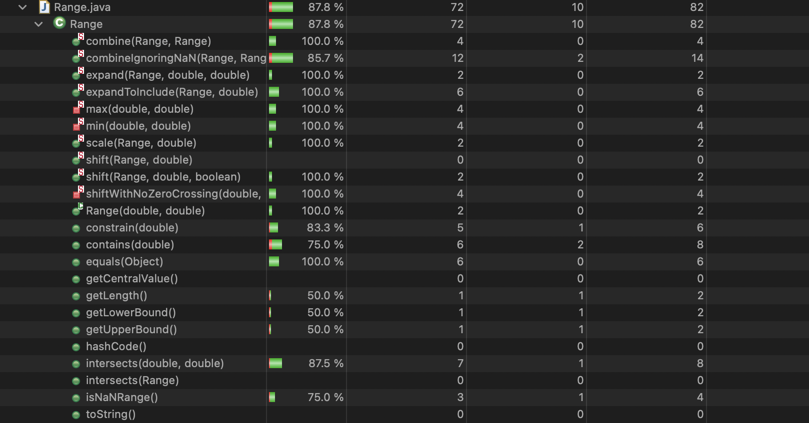
</div>

### Method Coverage Metric
<div style="background-color: #f0f0f0; width: 800px;">
    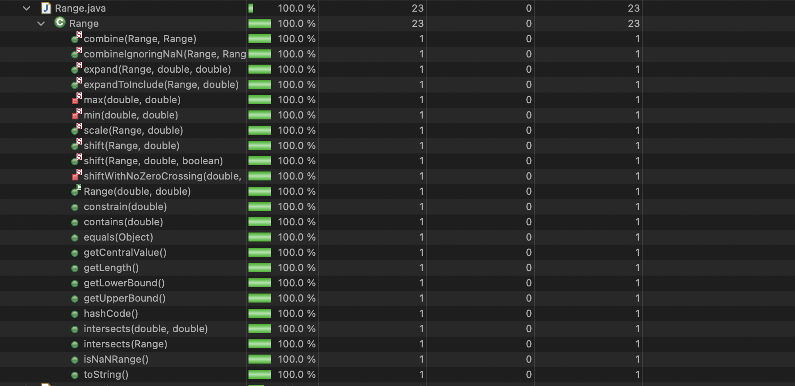
</div>

### Statement Coverage Metric
<div style="background-color: #f0f0f0; width: 800px;">
    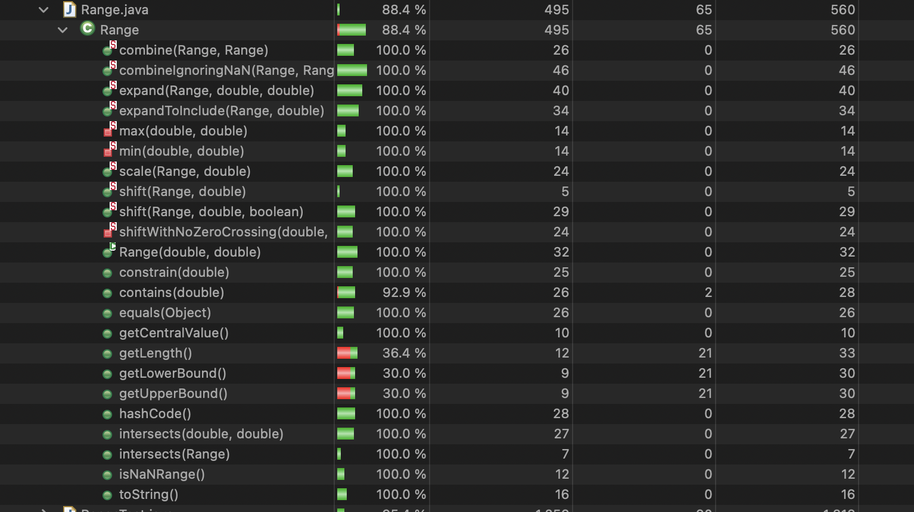
</div>

## Range Class - Lab 3 Mutation Score (Old)
<div style="background-color: #f0f0f0; width: 800px;">
    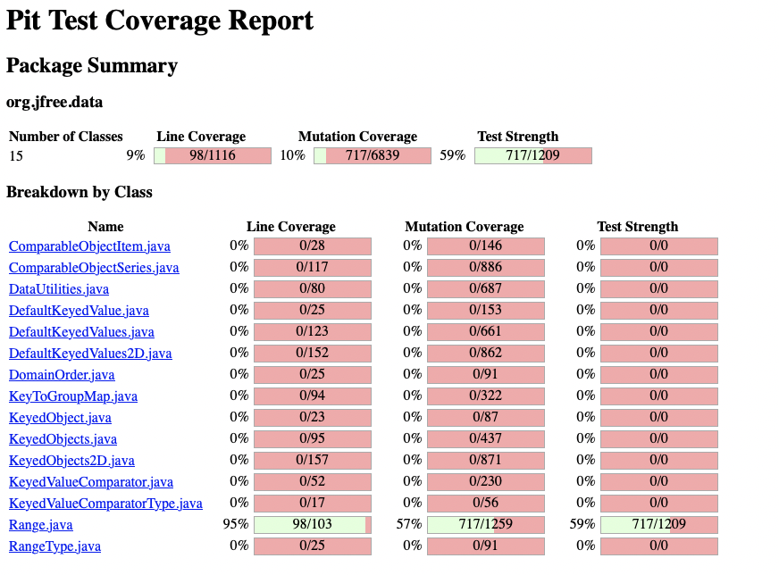
</div>

## Range Class - Lab 4 Statistics (New)
### Branch Coverage Metric
<div style="background-color: #f0f0f0; width: 800px;">
    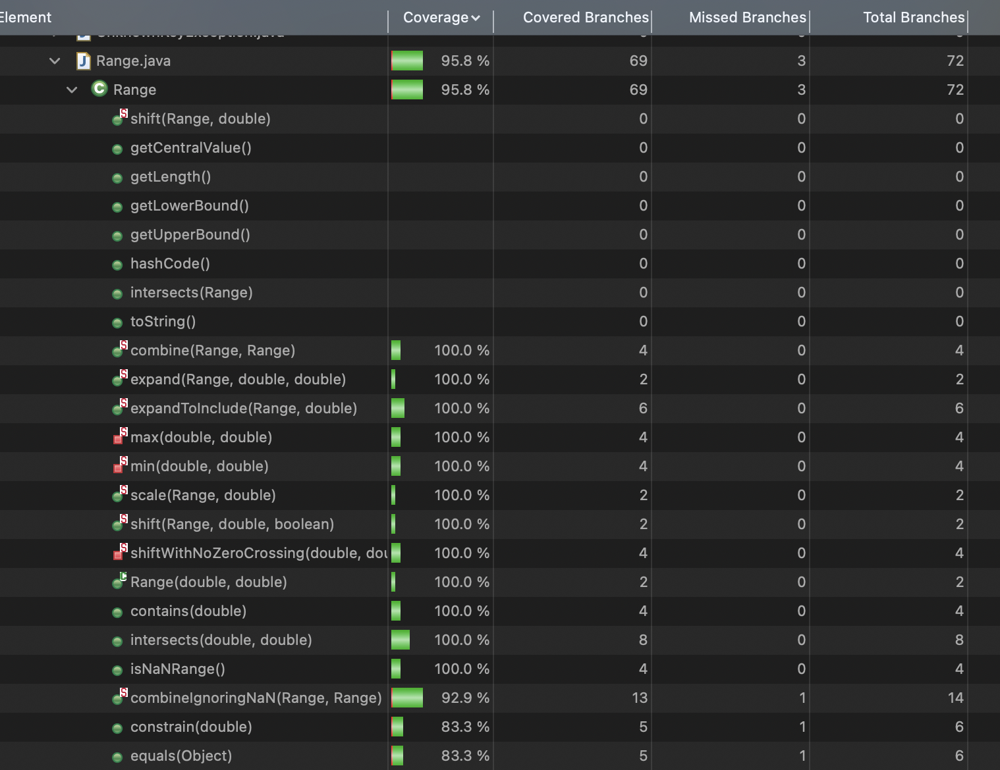
</div>

### Method Coverage Metric
<div style="background-color: #f0f0f0; width: 800px;">
    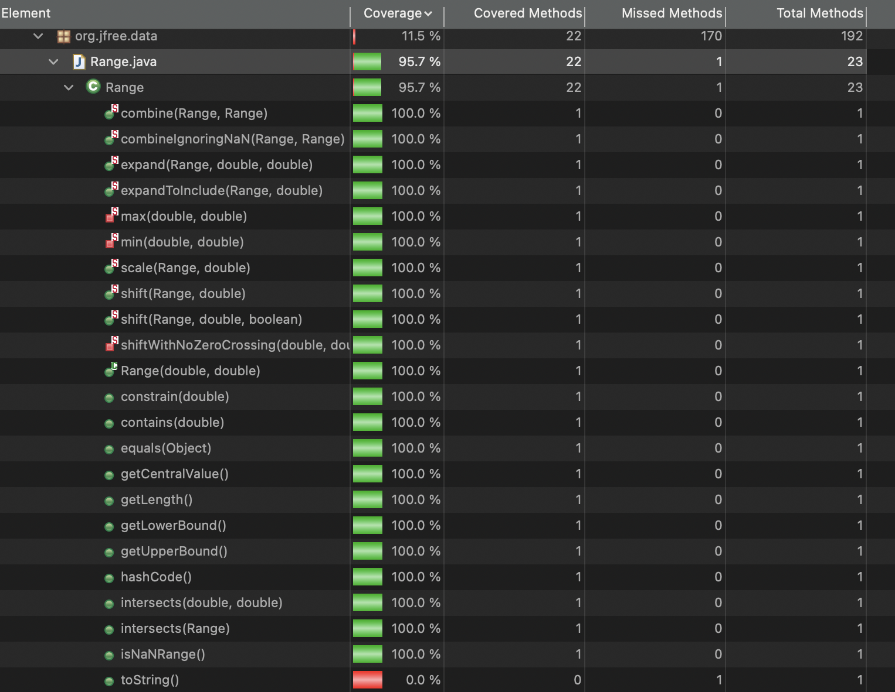
</div>

### Statement Coverage Metric
<div style="background-color: #f0f0f0; width: 800px;">
    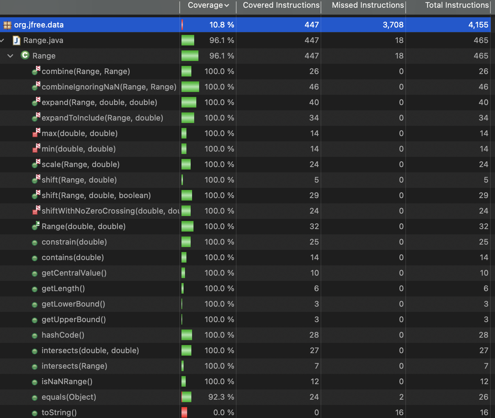
</div>

## Range Class - Lab 4 Mutation Score (New)
<div style="background-color: #f0f0f0; width: 800px;">
    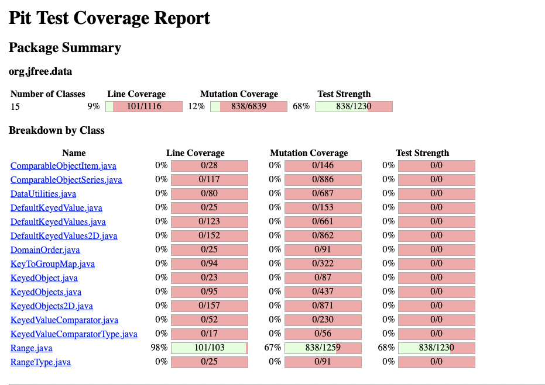
</div>


## DataUtilities Class - Lab 3 Statistics (Old)
### Branch Coverage Metric
<div style="background-color: #f0f0f0; width: 800px;">
    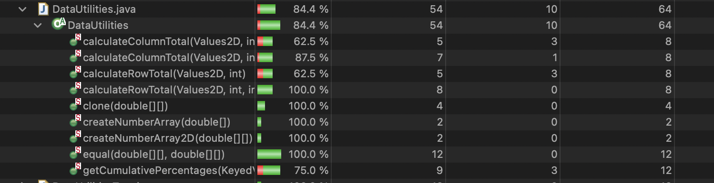
</div>

### Method Coverage Metric
<div style="background-color: #f0f0f0; width: 800px;">
    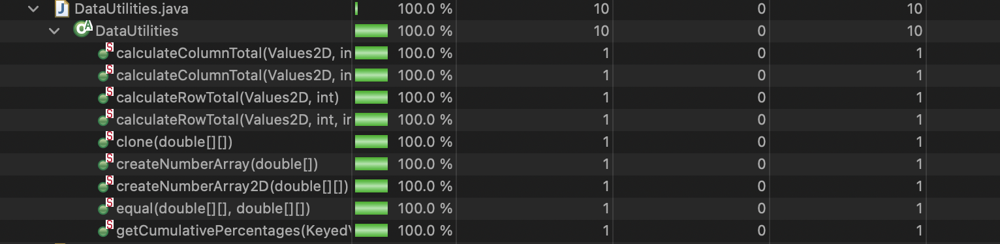
</div>

### Statement Coverage Metric
<div style="background-color: #f0f0f0; width: 800px;">
    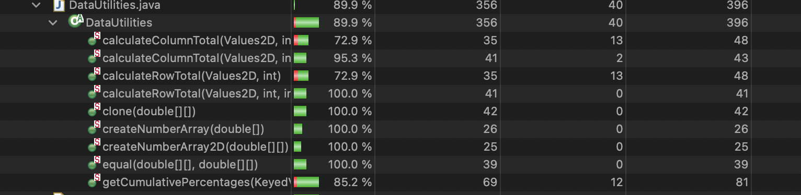
</div>

## DataUtilities Class - Lab 3 Mutation Score (Old)
<div style="background-color: #f0f0f0; width: 800px;">
    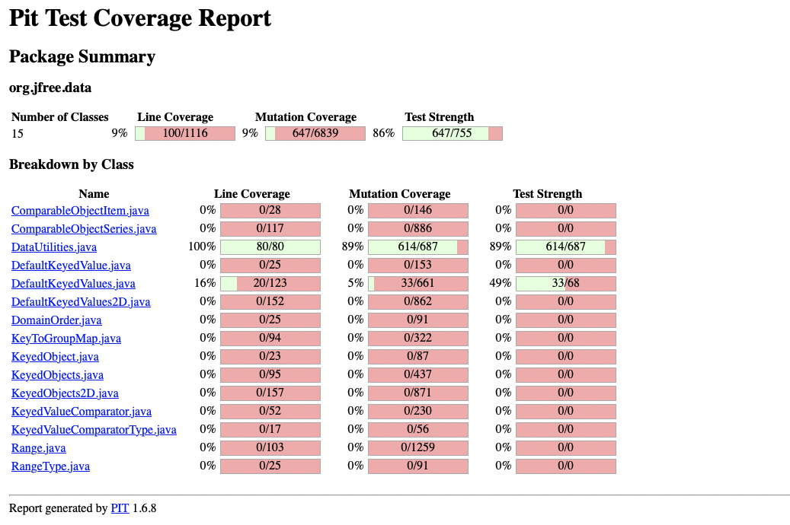
</div>


## DataUtilities Class - Lab 4 Statistics (New)
### Branch Coverage Metric
<div style="background-color: #f0f0f0; width: 800px;">
    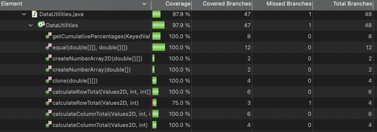
</div>

### Method Coverage Metric
<div style="background-color: #f0f0f0; width: 800px;">
    
</div>

### Statement Coverage Metric
<div style="background-color: #f0f0f0; width: 800px;">
    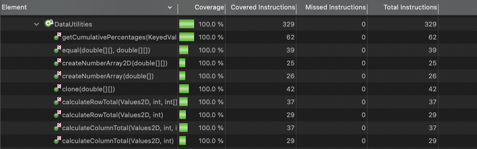
</div>

## DataUtilities Class - Lab 4 Mutation Score (New)
<div style="background-color: #f0f0f0; width: 800px;">
    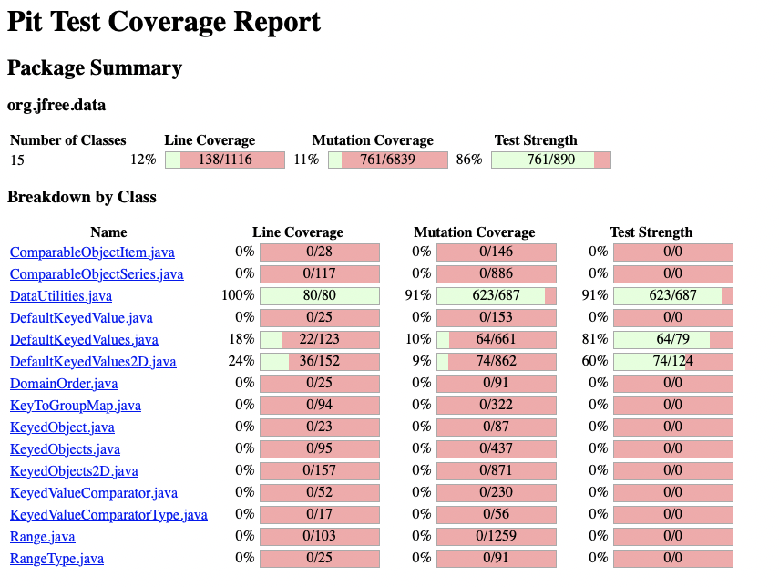
</div>


# Analysis drawn on the effectiveness of each of the test classes
## **DataUtilitesTest**

When looking at the coverage for DataUtilites from assignment 3 to assignment 4 we can see that our Branch Coverage went from 84.4% to 97.9%, our Method Coverage stayed at 100.0% and our Statement Coverage went from 89.9% to 100%! When we ran the PiTest for DataUtilities based on the code from assignment 3 we got a mutation coverage of 89% which is very high! Meaning our test for DataUtilities were built good and accounted for mutants very well (even if we didn’t try too). So we wrote some test cases targeted at mutants that survived which allowed us to increase our DataUtilities mutation coverage to 91%, which isn’t a very large increase but we had a lot of problems with increasing this number due to the large amount of surviving equivalent mutants. 

## **RangeTest**

When looking at the coverage for Range from assignment 3 to assignment 4 we can see that our Branch Coverage went from 87.8% to 95.8%, our Method Coverage went from 100.0% to 95.7% and our Statement Coverage went from 88.4% to 96.1%! When we ran the PiTest for Range based on the code from assignment 3 we got a mutation coverage of 57%. This indicated us that our Range test cases we there but not as good (robust) as we previously thought. So we wrote some test cases targeted at mutants that survived which allowed us to increase our Range mutation coverage to 67%, which made out test cases much stronger!

# A discussion on the effect of equivalent mutants on mutation score accuracy
Equivalent mutants are mutations in the code that do not change the behavior of the program. Such that it is impossible to make a test case that would kill that mutant or make that mutant survive. This is a problem as they still contribute to the mutation score and can inflate or deflate that score, without providing additional insights into the robustness of the test suite. These equivalent mutants can be hard to detect as it requires analyzing the branches and possible outcome of the code. We tried to detect these mutants by performing/using

- Manual inspections, where we manually review the mutated code and compare its behavior with the original code to determine if the mutation is equivalent. But this was very time-consuming.
- Automated code analysis tools we used, Pitest which is a mutation testing tool for Java. PIT had built-in mechanisms to detect and filter out equivalent mutants (Killed or Survived based on our test suite).

One equivalent mutant that we noticed a lot was “substituting 1 with -1”, where the test would test substituting 1 with -1. But In the case of `return (b == null);`, the mutation simply substitutes 1 with -1, which changes the condition to `return (b == -1);`. However, this mutated condition doesn't make logical sense in the context of checking for null. Which proves that not all mutants are testable.
Overall, detecting equivalent mutants requires a combination of automated tools and manual inspection. By identifying and filtering out equivalent mutants we can improve the test suite's effectiveness.

# A discussion of what could have been done to improve the mutation score of the test suites
## **Range Test Suite**
Our mutation score from lab 3 was 57%, so that means that we have tons of room to improve the the score. The first thing we did as a group was look at each PIT Mutations, and which bugs survived. This helped us identify which methods had more surviving mutations or had less surviving mutations. Through looking them, we saw that there was 4 main methods that had a lot of mutations, these were:

- constrain(double value)
- combineIgnoringNaN(Range range1, Range range2)
- expand(Range range, double lowerMargin, double upperMargin)
- isNaNRange()

Some of the test that we added for combineIgnoringNaN were testing `Mutated behavior: range1 is null` and `range2 is null` for example:

```
 // Test for line: if (range1 == null)
    @Test
    public void testCombineIgnoringNaNMutatedLine2() {
        Range range1 = null;
        Range range2 = new Range(0, 10);
        assertEquals(new Range(0, 10), Range.combineIgnoringNaN(range1, range2)); // Mutated behavior: range1 is null
    }

    // Test for line: if (range2 == null)
    @Test
    public void testCombineIgnoringNaNMutatedLine3() {
        Range range1 = new Range(0, 10);
        Range range2 = null;
        assertEquals(new Range(0, 10), Range.combineIgnoringNaN(range1, range2)); // Mutated behavior: range2 is null
    }
```

We also improve the mutation score of the test suites by removing redundant test cases. One issue we had with increasing the mutation score was equivalent mutants and how we were not able to always test that certain mutant. We ended up getting our mutation score to 67% for range and we believe that we may be able to further increase that value!

## **DataUtilities Test Suite**

Our mutation score from lab 3 was 89%, so that means that we already have a really good mutation score, which made it really hard to further improve! The first thing we did as a group was look at each PIT Mutations, and which bugs survived. This helped us identify which methods had more surviving mutations or had less surviving mutations. Through looking them, we saw that there was 3 main methods that had a lot of mutations, these were:

- equal(double[][] a, double[][] b)
- calculateRowTotal(Values2D data, int row)
- createNumberArray(double[] data)

But we quickly ran into a problem in the testing as many of the surviving mutationing were equivalent mutants, such that we were not able to test to many of these. For example, as mentioned above, one equivalent mutant that I noticed a lot was “substituting 1 with -1” where they want to test substituting 1 with -1. But In the case of `return (b == null);`, the mutation simply substitutes 1 with -1, which changes the condition to `return (b == -1);`. However, this mutated condition doesn't make logical sense in the context of checking for null. Which proves that not all mutants are testable. After writing and waiting a very long time for PiTest to run, we were able to increase our DataUtilities class from 89% mutant coverage to 91% mutant coverage! We weren’t able to increase mutant coverage to the full 10% due to the amount of equivalent mutants.

# Why do we need mutation testing? Advantages and disadvantages of mutation testing
We use mutation testing to evaluate the quality and effectiveness of software test suites. It involves introducing small changes (mutations) to the source code and running the test suite against these mutated versions to determine if the tests detect the changes. Advantages and disadvantages of mutation testing are as follows:

- **Advantages**
    - Effectiveness: Mutation testing provides a comprehensive assessment of the quality of the test suite by measuring its ability to detect faults in the code. Where a high mutation score indicates a good test suite and a low mutation score indicates a bad test suite.
    - Fault Detection: It helps identify weaknesses in the test suite by revealing areas where tests fail to detect changes in the code. This feedback enables developers to improve test coverage and strengthen the testing strategy.
    - Quality Assurance: By identifying areas of the code that are not adequately covered by tests, mutation testing helps improve overall software quality and reliability. It ensures that potential bugs are detected early in the development process.
- **Disadvantages**:
    - Resource Intensive: Generating and running mutations for every line of code requires significant computational resources. This was very noticeable during the lab as mutation testing was computationally expensive and extremely time-consuming!
    - Manual Analysis: Interpreting mutation testing results requires manual effort and expertise. We needed to analyze the results and make informed decisions about how to refine the tests.
    - False Positives: Some mutations may not represent real faults in the code but still result in test failures. This happened to us quite often, wasting our time.

# Explain your SELENUIM test case design process
Our design process to create and execute tests on [`https://www.ebay.com/`](https://www.ebay.com/), was to come up with 8 different functionalities of the application (What a customer/user would do on the site), which were:

1. Sort Search Results - Hamd
2. View Product Details - Noel
3. Add Item to Watchlist - Dom
4. Purchase Item - Dom
5. Manage Account Settings - Noel
6. Create a Saved Search - Hamd
7. Click on the "Sign up" link - Alex 
8. Click on the "Sign In" link - Alex


# Explain the use of assertions and checkpoints
During the development of the Selenium tests we all used Assertions and Checkpoints to check the scripts to see if they match the expected value. In Selenium, checkpoints were automatically done as the code ran and we were all able to follow these checkpoints very easily to validate the program! We mainly used assertions to validate the correctness of the application, this was done manually through assert statements such as assert value, assert element present, and assert element not present. We usually did this at the end of the program to validate the result, such as seeing if the user signed in correctly (displays there first name in the top left corner) or checking to see if a selected item to wishlist matches the same item on the wishlist. This allowed for us to automatically verify the output of tests and detect any deviations from expected behavior/look.

# how did you test each functionaity with different test data

1. Sort Search Results:
    - Test functionalities:
        - Perform a search for a product.
        - Sort the search results by sort criteria.
        - Verify that the search results are displayed matching to the sort criteria.
    - Test Data:
        - Sort by ascending order (price low to high) 
        - Sort by descending order (price high to low)
        - Search for a popular product with multiple sellers.
    - Expected Outcome:
        - Verify that sorting by price displays search results matching sort criteria
2. View Product Details:
    - Test functionalities:
        - Navigate to a product page.
        - Verify that all relevant details such as product name, price, description, and seller information are displayed correctly.
    - Test Data:
        - Navigate to a product page with various types of products (e.g., electronics, clothing).
    - Expected Outcome:
        - Ensure all relevant product details (name, price, description, seller information) are correctly displayed.
3. Add Item to Watchlist:
    - Test functionalities:
        - Navigate to a product page.
        - Click on the "Add to Watchlist" button.
        - Verify that the item is added to the user's watchlist.
    - Test Data:
        - Select products with different categories and price ranges.
    - Expected Outcome:
        - Confirm that items are successfully added to the watchlist (done with comparing the products name)
4. Purchase Item:
    - Test functionalities:
        - Navigate to a product page.
        - Enter the desired quantity.
        - Click on the "Buy It Now" button.
        - Proceed through the checkout process by entering shipping and payment details (we did not enter valid details lol)
    - Test Data:
        - Select different products with varying prices.
        - Tested with different payment methods (to an extent as we did not enter valid details)
    - Expected Outcome:
        - Validate successful purchase completion (we would expect if we actually purchased item(
5. Manage Account Settings:
    - Test functionalities:
        - Click on the user profile icon.
        - Navigate to the account settings page.
        - Update personal information such as address, email, or password.
        - Verify that the changes are saved successfully.
    - Test Data:
        - Update personal information (address, email, password) with valid and invalid data.
    - Expected Outcome:
        - Ensure changes are saved correctly and validation messages appear for invalid data.
6. Create a Saved Search:
    - Test functionalities:
        - Perform a search for a product.
        - Click on the "Save this search" button.
        - Verify that the search is saved to the user's saved searches.
        - Navigate to the saved searches page.
        - Verify that the correct product is saved and is listed.
    - Test Data:
        - Save searches for different product categories.
        - Save Search for one Product
        - Save Search for more than one Product
    - Expected Outcome:
        - Verify that searches are saved to the saved searches page.
7. Click on the "Sign up" link.
    - Test functionalities:
        - Enter valid credentials.
        - Click on the "Sign up" button.
        - Verify that the user is logged in successfully.
        - Register a New Account.
    - Test Data:
        - Register with valid credentials.
        - Register with invalid or incomplete information (not valid email, and not valid password)
    - Expected Outcome:
        - Confirm successful registration with valid data and appropriate error handling for invalid data.
8. Click on the "Sign In" link.
    - Test functionalities:
        - Enter valid credentials.
        - Click on the "Sign In" button.
        - Verify that the user is logged in successfully.
        - Sign In to Account
    - Test Data:
        - Sign in with valid credentials.
        - Sign in with incorrect password or username (tried an email that had no account created)
    - Expected Outcome:
        - Ensure successful login with valid credentials and appropriate error message.

# Discuss advantages and disadvantages of Selenium vs. Sikulix
- Advantages of Selenium:
    - Wide Browser Support: Selenium supports various web browsers, including Chrome, Firefox, Safari, and Edge, making it suitable for cross-browser testing!
    - When researching Selenium we saw that it can be easily integrated with popular programming languages and frameworks such as Java and Python allowing for flexible test automation solutions.
    - Also we noticed that Selenium has been in use for a long time so that means that it has a good ecosystem and good documentation!
- Disadvantages of Selenium:
    - Very finicky, when using the google chrome extension we all noticed that any click or hover was recorded, which is a good thing but always gave problems without editing the Selenium script.
    - Selenium requires programming skills and a good understanding of web technologies, which can pose a challenge for beginners. This was evident when we tried to build a java project, as we had to understand frontend languages.
    - One other thing when learning and playing with Selenium in java, is we found out how slow it is (how long it takes).
    - A major disadvantage is that Selenium has very little Support for Desktop Applications and has no built-in image recognition.
- Advantages of SikuliX:
    - SikuliX offers powerful image recognition capabilities, allowing us to automate scenarios where elements cannot be directly accessed through traditional locators.
    - One major advantage is simplicity as SikuliX simplifies test automation by enabling testers to automate tasks based on visual elements without requiring deep knowledge of web technologies or programming!
    - Another major advantage is SikuliX can automate not only web applications but also desktop applications, virtual machines, and even games!
    - SikuliX is platform-independent and can be used for automating tests on Windows, macOS, and Linux operating systems
- Disadvantages of SikuliX:
    - SikuliX has very limited text-based automation as it relies heavily on image recognition
    - Through research, we noticed that Image-based automation may be slower and less efficient compared to traditional locators!
    - SikuliX tests may be more prone to breakage due to changes in UI layout or appearance, especially when the UI changes based on the user…
    - Lastly, dynamic content such as position, and size can lead to problems in the test script design and maintenance.

# How the team work/effort was divided and managed
As a team, we decided to split the work by class. Two members worked on the Range.java class coverage tests while the other two members worked on the DataUtilities.java coverage tests. Once all testing was completed, all members reviewed the work of others, adding comments where needed and fixing any logical errors found. This divided the work load between team members, while achieving effective progress. For the Selenium each of use automated at 2 different functionalities of the ebay.ca!

# Difficulties encountered, challenges overcome, and lessons learned
Throughout this assignment, we did not face any major challenges as a group. However, we did face some challenges in communication of which group member is testing which method. In addition to this, learning to work with the new coverage tools for mutant testing was a challenge as all members in the group were unfamiliar with the technology. However, we were able to overcome this challenge through exploration of the technology, including trial and error when testing our methods. We were able to utilize the documentation to learn where to find the different coverage metrics and how to read the results.

# Comments/feedback on the lab itself
As a group we really enjoyed this lab, it was helpful getting us familiar with the mutant testing process, and using some concepts we learned in class in a real time environment. Additionally, we all learned a lot about mutant test, as well as Selenium! We found the lab document itself great and very easy to understand. Furthermore, the lab structure allowed for effective learning of testing methodologies and signified the importance of testing in a variety of methods.

