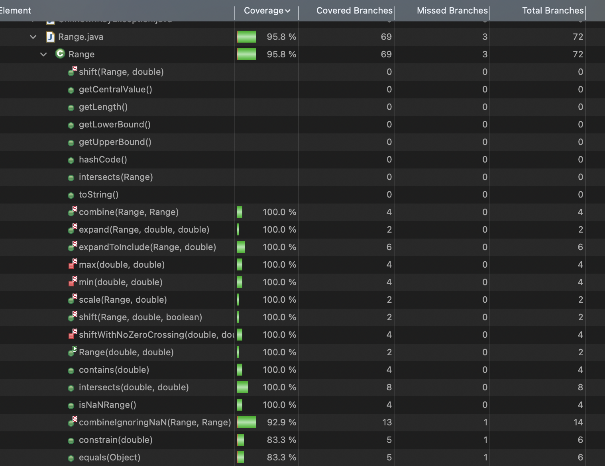

**SENG 438 - Software Testing, Reliability, and Quality**

**Lab. Report \#4 – Mutation Testing and Web app testing**

| Group \#:  1         |
| --------------     |
| Dominic Gartner    |
| Hamd Khan          |
| Alexander Mclean   |
| Noel Thomas        |

# Introduction


# Analysis of 10 Mutants of the Range class 
## Range Function:
```
89    public Range(double lower, double upper) {
90        if (lower > upper) {
91           String msg = "Range(double, double): require lower (" + lower
92               + ") <= upper (" + upper + ").";
93           throw new IllegalArgumentException(msg);
94       }
95       this.lower = lower;
96       this.upper = upper;
97   }
``` 


## Mutants:
### Survived Mutants:
- Line 90: removed conditional
  - replaced comparison check with false The test suite did not cover cases where lower > upper, so this mutant survived.
- Line 95: Decremented (a--) double local variable number 1
  - This mutant tells us that our test suite did not cover the case of changing the value of lower to be decremented by 1.
- Line 95: Incremented (a++) double local variable number 1
  - This mutant tells us that our test suite did not cover the case of changing the value of lower to be incremented by 1.
- Line 96: Decremented (a--) double local variable number 3
  - This mutant tells us that our test suite did not cover the case of changing the value of lower to be decremented by 3.
- Line 96: Incremented (a++) double local variable number 3
  - This mutant tells us that our test suite did not cover the case of changing the value of lower to be incremented by 3.
### Killed Mutants:
- Line 90: removed conditional - replaced comparison check with true
  - The original test suite had cases where lower was greater than upper, and it verified that an IllegalArgumentException is thrown in such cases.
- Line 95: Negated double local variable number 1
  - The test suite verified that lower is assigned correctly, so negating it would fail the test assertions.
- Line 95: Removed assignment to member variable lower
  - Similar to Mutant 95, the test suite verified that upper is assigned correctly, so negating it would fail the test assertions.
- Line 96: Negated double local variable number 3
  - Killing this mutant showed that our test suite ensures the correct setting of the upper bound.
- Line 96: Removed assignment to member variable upper
  - This mutant indicates that our test suite verified the proper initialization of the upper bound.


# Report all the statistics and the mutation score for each test class
## Range Class - Lab 3 Statistics (Old)
### Branch Coverage Metric
<div style="background-color: #f0f0f0; width: 800px;">
    
</div>

### Method Coverage Metric
<div style="background-color: #f0f0f0; width: 800px;">
    
</div>

### Statement Coverage Metric
<div style="background-color: #f0f0f0; width: 800px;">
    
</div>

## Range Class - Lab 3 Mutation Score (Old)
<div style="background-color: #f0f0f0; width: 800px;">
    
</div>


## Range Class - Lab 4 Statistics (New)
### Branch Coverage Metric
<div style="background-color: #f0f0f0; width: 800px;">
    
</div>

### Method Coverage Metric
<div style="background-color: #f0f0f0; width: 800px;">
    
</div>

### Statement Coverage Metric
<div style="background-color: #f0f0f0; width: 800px;">
    
</div>

## Range Class - Lab 4 Mutation Score (New)
<div style="background-color: #f0f0f0; width: 800px;">
    
</div>


## DataUtilities Class - Lab 3 Statistics (Old)


# Analysis drawn on the effectiveness of each of the test classes

# A discussion on the effect of equivalent mutants on mutation score accuracy

# A discussion of what could have been done to improve the mutation score of the test suites

# Why do we need mutation testing? Advantages and disadvantages of mutation testing

# Explain your SELENUIM test case design process

# Explain the use of assertions and checkpoints

# how did you test each functionaity with different test data

# Discuss advantages and disadvantages of Selenium vs. Sikulix

# How the team work/effort was divided and managed


# Difficulties encountered, challenges overcome, and lessons learned

# Comments/feedback on the lab itself
